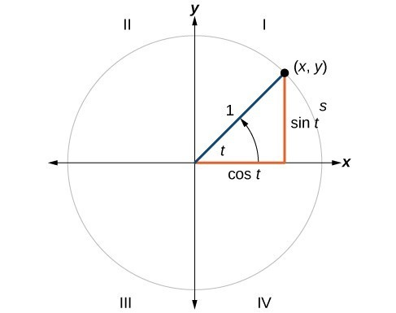

[Geometria](README.md)  

# Trigonometria

# Funções triogonométricas

As funções trigonométricas (funções circulares) estão relacionadas com as voltas no ciclo trigonométrico.

- Função seno
- Função cosseno
- Função tangente

Funções periódicas são funções que possuem um comportamento periódico. Um período corresponde ao menor intervalo de tempo em que acontece a repetição de determinado fenômeno. As funções trigonométricas são exemplos de funções períodicas.


# Seno e Cosseno

As funções seno e cosseno oscilam continuamente entre -1 e 1 pois são funções periódicas.

```
    sin(x) ∈ [-1, 1]
    cos(x) ∈ [-1, 1]
```


# Relação de seno e cosseno com círculo trigonométrico

Uma volta completa em um círculo é igual a 2pi.
Quando utilizamos valores de 0 a 2pi em funções seno e cosseno, podemos obter as coordenadas x e y dos pontos do círculo.



```
  x = radius * cos(angle);
  y = radius * sin(angle);
```


# Ângulos de Euler

Leonhard Euler definiu que qualquer rotação em 3D podem ser representados por três valores chamados de **ângulos de Euler**:  **pitch**, **yaw** e **roll**.


# Referências

- https://www.todamateria.com.br/funcoes-trigonometricas/
